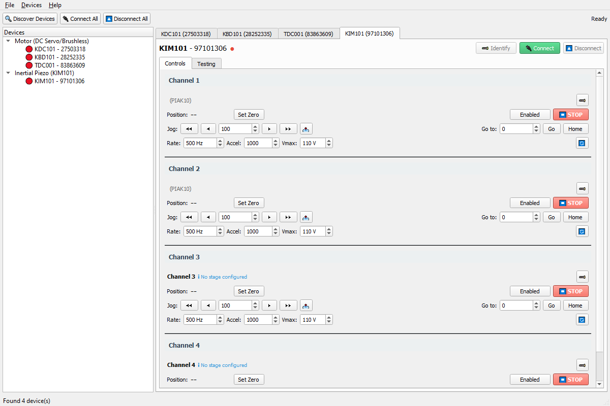
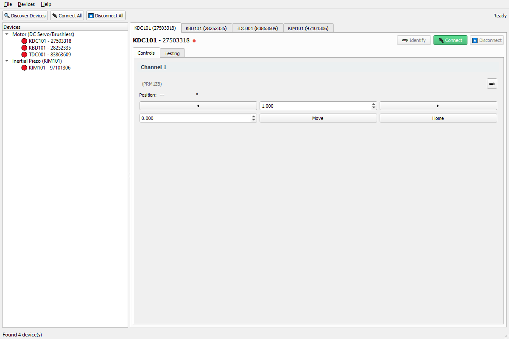
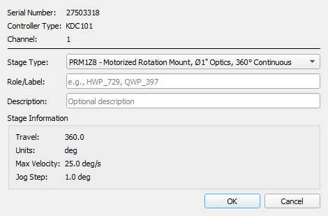
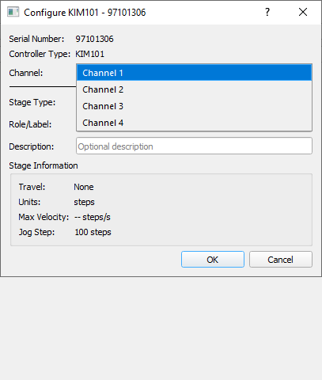
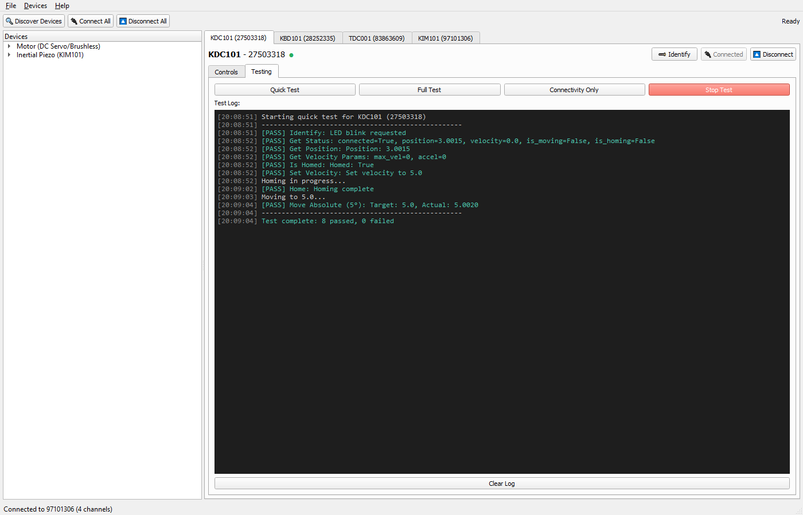
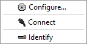

# ThorlabsMotionControl

[](https://www.python.org/downloads/)
[](https://opensource.org/licenses/MIT)
[](https://www.thorlabs.com/software_pages/ViewSoftwarePage.cfm?Code=Motion_Control)

A unified Python interface for Thorlabs motion control hardware, supporting K-Cube and T-Cube 
controllers via Kinesis .NET and APT COM backends.

---

## Table of Contents

- [Features](#features)
- [Supported Hardware](#supported-hardware)
- [Requirements](#requirements)
- [Installation](#installation)
- [Quick Start](#quick-start)
- [Project Structure](#project-structure)
- [API Reference](#api-reference)
- [Testing](#testing)
- [GUI](#gui)
- [Troubleshooting](#troubleshooting)
- [Contributing](#contributing)
- [License](#license)

---

## Features

- **Unified API** — Single interface for DC servo, brushless DC, piezo inertial, and piezo voltage controllers
- **Dual Backend Support** — Kinesis .NET (64-bit) and APT COM (32-bit fallback)
- **Automatic Device Discovery** — Scan USB for connected Thorlabs devices
- **Stage Auto-Detection** — Query motor EEPROM to identify connected stages
- **Comprehensive Test Suite** — Hardware validation tests for all supported controllers (88+ tests)
- **Qt-based GUI** — Optional graphical interface for device control
- **Configuration Persistence** — Save device-to-stage mappings
- **Context Manager Support** — Safe resource handling with `with` statements

---

## Supported Hardware

### Controllers

| Controller | Type | Channels | Serial Prefix | Description |
|------------|------|----------|---------------|-------------|
| **KDC101** | DC Servo | 1 | 27 | K-Cube DC Servo Motor Driver |
| **KBD101** | Brushless DC | 1 | 28 | K-Cube Brushless DC Motor Driver |
| **TDC001** | DC Servo | 1 | 83 | T-Cube DC Servo Motor Driver (Legacy) |
| **KIM101** | Inertial | 4 | 97 | K-Cube Inertial Motor Driver |
| **KPZ101** | Piezo | 1 | 29 | K-Cube Piezo Driver |
| **TPZ001** | Piezo | 1 | 81 | T-Cube Piezo Driver (Legacy) |

### Compatible Stages

<details>
<summary><strong>Rotation Mounts</strong> (DC Servo - KDC101/TDC001)</summary>

| Stage | Travel | Resolution | Description |
|-------|--------|------------|-------------|
| PRM1Z8 | 360° | 25 arcsec | Rotation Mount |
| PRM1/MZ8 | 360° | 25 arcsec | Rotation Mount (metric) |
| HDR50 | 360° | 25 arcsec | Heavy-Duty Rotation Mount |
| K10CR1 | 360° | 25 arcsec | Rotation Mount |
| DDR25 | 360° | - | Direct-Drive Rotation Stage (25mm) |
| DDR100 | 360° | - | Direct-Drive Rotation Stage (100mm) |

</details>

<details>
<summary><strong>Linear Stages</strong> (DC Servo - KDC101/TDC001)</summary>

| Stage | Travel | Resolution | Description |
|-------|--------|------------|-------------|
| Z825B | 25mm | 29nm | Motorized Actuator |
| Z812B | 12mm | 29nm | Motorized Actuator |
| Z612B | 12mm | 29nm | Motorized Actuator |
| MTS25-Z8 | 25mm | 29nm | Translation Stage |
| MTS50-Z8 | 50mm | 29nm | Translation Stage |
| LTS150 | 150mm | - | Long Travel Stage |
| LTS300 | 300mm | - | Long Travel Stage |
| PT1-Z8 | 25mm | - | Translation Stage |

</details>

<details>
<summary><strong>Direct-Drive Stages</strong> (Brushless DC - KBD101)</summary>

| Stage | Travel | Max Velocity | Description |
|-------|--------|--------------|-------------|
| DDS100 | 100mm | 500mm/s | Direct-Drive Stage |
| DDSM100 | 100mm | 500mm/s | Direct-Drive Stage (metric) |
| DDS220 | 220mm | 500mm/s | Direct-Drive Stage |
| DDS300 | 300mm | 500mm/s | Direct-Drive Stage |
| DDS600 | 600mm | 500mm/s | Direct-Drive Stage |

</details>

<details>
<summary><strong>Piezo Inertia Actuators</strong> (KIM101)</summary>

| Stage | Travel | Step Size | Description |
|-------|--------|-----------|-------------|
| PIA13 | 13mm | 20nm | Piezo Inertia Actuator |
| PIA25 | 25mm | 20nm | Piezo Inertia Actuator |
| PIA50 | 50mm | 20nm | Piezo Inertia Actuator |
| PIAK10 | 10mm | 20nm | Piezo Inertia Actuator (compact) |
| PIAK25 | 25mm | 20nm | Piezo Inertia Actuator (compact) |

</details>

<details>
<summary><strong>Piezo Stages</strong> (KPZ101/TPZ001)</summary>

| Stage | Travel | Description |
|-------|--------|-------------|
| PK4FA7P1 | 7µm | Piezo Stack Actuator |
| PAZ005 | 5µm | Z-Axis Piezo Stage |
| PAZ015 | 15µm | Z-Axis Piezo Stage |
| POLARIS-K1PZ | - | Piezo Mirror Mount |

</details>

---

## Requirements

### System Requirements

| Requirement | Specification |
|-------------|---------------|
| **Operating System** | Windows 10/11 (64-bit recommended) |
| **Python** | 3.8 or higher |
| **Thorlabs Kinesis** | v1.14.x or higher |

### Python Dependencies

```
pythonnet>=3.0.0    # .NET CLR interop (Kinesis backend)
pywin32>=305        # Windows COM support (APT backend)
PyQt5>=5.15         # GUI (optional)
```

### Kinesis Installation

**Download Link:** [Thorlabs Kinesis Software](https://www.thorlabs.com/software_pages/ViewSoftwarePage.cfm?Code=Motion_Control)

#### Choosing the Right Version

Thorlabs provides three installer versions. **The version you install must match your Python architecture:**

| Windows OS | Python Architecture | Kinesis Installer | Install Path |
|------------|---------------------|-------------------|--------------|
| 32-bit | 32-bit | 32-bit (x86) | `C:\Program Files\Thorlabs\Kinesis` |
| 64-bit | 32-bit | 32-bit (x86 on x64) | `C:\Program Files (x86)\Thorlabs\Kinesis` |
| 64-bit | 64-bit | **64-bit (x64)** ✅ | `C:\Program Files\Thorlabs\Kinesis` |

> **⚠️ Important:** The Kinesis DLLs must match your Python bitness, NOT your Windows bitness!
> A 64-bit Windows machine running 32-bit Python requires the 32-bit Kinesis installer.

Check your Python architecture:
```python
import struct
print(f"{struct.calcsize('P') * 8}-bit Python")
```

#### Required DLLs

This package requires the following Kinesis DLLs (installed automatically with Kinesis):

| DLL | Controller(s) | Purpose |
|-----|---------------|---------|
| `Thorlabs.MotionControl.DeviceManagerCLI.dll` | All | Core device management |
| `Thorlabs.MotionControl.KCube.DCServoCLI.dll` | KDC101 | K-Cube DC servo motor |
| `Thorlabs.MotionControl.KCube.BrushlessMotorCLI.dll` | KBD101 | K-Cube brushless motor |
| `Thorlabs.MotionControl.TCube.DCServoCLI.dll` | TDC001 | T-Cube DC servo motor |
| `Thorlabs.MotionControl.KCube.InertialMotorCLI.dll` | KIM101 | K-Cube piezo inertial motor |
| `Thorlabs.MotionControl.KCube.PiezoCLI.dll` | KPZ101 | K-Cube piezo voltage |
| `Thorlabs.MotionControl.TCube.PiezoCLI.dll` | TPZ001 | T-Cube piezo voltage |

#### Kinesis vs APT

**Kinesis is the only software required.** Kinesis is the successor to APT (Advanced Positioning Technology) and includes backwards compatibility with all APT-era hardware (T-Cubes, etc.).

| Software | Status | Notes |
|----------|--------|-------|
| **Kinesis** | ✅ Required | Modern .NET API, supports all controllers |
| **APT** | ❌ Not needed | Legacy COM-based, superseded by Kinesis |

#### Verifying Installation

After installing Kinesis, verify the DLLs are present:

```powershell
# Check 64-bit installation
ls "C:\Program Files\Thorlabs\Kinesis\*.dll" | Select-Object -First 5

# Check 32-bit installation (on 64-bit Windows)
ls "C:\Program Files (x86)\Thorlabs\Kinesis\*.dll" | Select-Object -First 5
```

You can also verify from Python:
```python
from pathlib import Path

kinesis_paths = [
    Path(r"C:\Program Files\Thorlabs\Kinesis"),
    Path(r"C:\Program Files (x86)\Thorlabs\Kinesis"),
]

for path in kinesis_paths:
    if path.exists():
        dlls = list(path.glob("Thorlabs.MotionControl.*.dll"))
        print(f"{path}: {len(dlls)} DLLs found")
```

---

## Installation

### Option 1: As a Git Submodule (Recommended)

```bash
# Add as submodule to your project
git submodule add <repository-url> Hardware/ThorlabsMotionControl

# Initialize submodule (when cloning parent repo)
git submodule update --init --recursive
```

### Option 2: Direct Copy

```bash
# Copy package to your project
cp -r ThorlabsMotionControl /path/to/your/project/Hardware/
```

### Install Dependencies

```bash
pip install pythonnet pywin32
pip install PyQt5  # Optional, for GUI
```

---

## Quick Start

### Device Discovery

```python
from Hardware.ThorlabsMotionControl import discover_devices

# Find all connected Thorlabs devices
devices = discover_devices()
for dev in devices:
    print(f"{dev['controller_type']}: {dev['serial']} - {dev['description']}")

# Example output:
# KDC101: 27503318 - K-Cube DC Servo Motor Driver
# KBD101: 28252335 - K-Cube Brushless DC Motor Driver
# KIM101: 97101306 - K-Cube Inertial Motor Driver (4-channel)
```

### DC Servo / Brushless DC Controllers

```python
from Hardware.ThorlabsMotionControl import create_controller

# Using context manager (recommended)
with create_controller('KDC101', serial_number=27503318) as ctrl:
    # Home the stage
    ctrl.home(wait=True)
    print(f"Homed. Position: {ctrl.get_position()}")
    
    # Move to absolute position (in mm or degrees)
    ctrl.move_absolute(10.0, wait=True)
    print(f"Position: {ctrl.get_position()}")
    
    # Move relative
    ctrl.move_relative(5.0, wait=True)
    print(f"Position: {ctrl.get_position()}")
    
    # Get status
    status = ctrl.get_status()
    print(f"Is homed: {status['is_homed']}")
```

### KIM101 Inertial Motor Controller

```python
from Hardware.ThorlabsMotionControl import create_controller

with create_controller('KIM101', serial_number=97101306) as ctrl:
    # KIM101 has 4 independent channels
    
    # Jog channel 1 forward by 100 steps
    ctrl.jog(channel=1, direction='forward', steps=100)
    
    # Move channel 2 to absolute position (step count)
    ctrl.move_to(channel=2, position=1000)
    
    # Get position of all channels
    for ch in range(1, 5):
        pos = ctrl.get_position(channel=ch)
        print(f"Channel {ch}: {pos} steps")
```

### Manual Connection Management

```python
from Hardware.ThorlabsMotionControl.kinesis import KDC101Controller

# Create controller
ctrl = KDC101Controller(serial_number=27503318)

try:
    # Connect
    ctrl.connect()
    
    # Identify device (blinks LED)
    ctrl.identify()
    
    # Your operations here...
    
finally:
    # Always disconnect
    ctrl.disconnect()
```

---

## Project Structure

```
ThorlabsMotionControl/
├── README.md                # This file
├── CONTRIBUTING.md          # Contribution guidelines
├── LICENSE                  # MIT License
│
├── __init__.py              # Package exports & version
├── __main__.py              # CLI entry point (python -m ThorlabsMotionControl)
├── base.py                  # Abstract base classes
├── controllers.py           # Controller registry & specifications
├── device_manager.py        # Device discovery & factory functions
├── stages.py                # Stage database (31 stages)
├── gui.py                   # Qt-based GUI
│
├── kinesis/                 # Kinesis .NET Backend (64-bit)
│   ├── __init__.py
│   ├── kdc101.py            # K-Cube DC Servo
│   ├── kbd101.py            # K-Cube Brushless DC
│   ├── kim101.py            # K-Cube Inertial Motor
│   ├── kpz101.py            # K-Cube Piezo
│   └── tdc001.py            # T-Cube DC Servo
│
├── apt/                     # APT COM Backend (32-bit fallback)
│   ├── __init__.py
│   ├── motor.py             # DC Servo/Brushless adapter
│   └── piezo.py             # Piezo adapter
│
├── config/
│   └── devices.json         # User device configurations
│
└── tests/                   # Comprehensive test suite
    ├── README.md            # Testing documentation
    ├── __init__.py
    ├── run_all_tests.py     # Master test runner
    ├── test_kdc101.py       # KDC101 tests (20 tests)
    ├── test_kbd101.py       # KBD101 tests (21 tests)
    ├── test_tdc001.py       # TDC001 tests (20 tests)
    └── test_kim101.py       # KIM101 tests (27 tests)
```

---

## API Reference

### Factory Functions

```python
from Hardware.ThorlabsMotionControl import (
    discover_devices,           # Find all connected devices
    discover_devices_with_stages,  # Find devices + stage info
    create_controller,          # Create controller by type
    get_controller_types,       # List supported controller types
)
```

### Base Classes

| Class | Controllers | Description |
|-------|-------------|-------------|
| `MotorController` | KDC101, KBD101, TDC001 | DC servo and brushless motor base |
| `InertialController` | KIM101 | Piezo inertial motor base |
| `PiezoController` | KPZ101, TPZ001 | Piezo voltage controller base |

### MotorController Methods

| Method | Returns | Description |
|--------|---------|-------------|
| `connect()` | `bool` | Establish connection |
| `disconnect()` | `None` | Close connection |
| `identify()` | `None` | Flash front panel LED |
| `home(wait=True, timeout=60.0)` | `bool` | Home the stage |
| `move_absolute(position, wait=True)` | `bool` | Move to absolute position |
| `move_relative(distance, wait=True)` | `bool` | Move by relative distance |
| `stop()` | `None` | Emergency stop |
| `get_position()` | `float` | Get current position |
| `get_status()` | `dict` | Get comprehensive status |
| `get_velocity_params()` | `dict` | Get velocity settings |
| `set_velocity(velocity)` | `bool` | Set max velocity |
| `set_acceleration(accel)` | `bool` | Set acceleration |
| `is_homed()` | `bool` | Check if homed |
| `get_stage_info()` | `dict` | Get connected stage info |

### MotorController Properties

| Property | Type | Description |
|----------|------|-------------|
| `is_connected` | `bool` | Connection state |
| `is_moving` | `bool` | Movement state |
| `state` | `ControllerState` | Current state enum |
| `serial_number` | `int` | Device serial number |

### Controller State Enum

```python
from Hardware.ThorlabsMotionControl.base import ControllerState

ControllerState.DISCONNECTED  # Not connected
ControllerState.CONNECTING    # Connection in progress
ControllerState.CONNECTED     # Ready for commands
ControllerState.HOMING        # Homing in progress
ControllerState.MOVING        # Movement in progress
ControllerState.ERROR         # Error state
```

### Exceptions

```python
from Hardware.ThorlabsMotionControl.base import (
    MotionControlError,    # Base exception
    ConnectionError,       # Connection failures
    MovementError,         # Movement failures
    ConfigurationError,    # Configuration issues
)
```

---

## Testing

The package includes a comprehensive test suite with 88+ tests across 4 device types.

### Quick Commands

```bash
# List connected devices
python -m Hardware.ThorlabsMotionControl.tests.run_all_tests --list

# Test all connected devices
python -m Hardware.ThorlabsMotionControl.tests.run_all_tests

# Test specific device type
python -m Hardware.ThorlabsMotionControl.tests.run_all_tests --type KIM

# Interactive device selection
python -m Hardware.ThorlabsMotionControl.tests.run_all_tests --select
```

### Test Coverage

| Test Suite | Controller | Tests | Coverage |
|------------|------------|-------|----------|
| `test_kdc101.py` | KDC101 | 20 | Full API |
| `test_kbd101.py` | KBD101 | 21 | Full API + stage detection |
| `test_tdc001.py` | TDC001 | 20 | Full API |
| `test_kim101.py` | KIM101 | 27 | Full API + all 4 channels |

See [tests/README.md](tests/README.md) for detailed testing documentation.

---

## GUI

The ThorlabsMotionControl package includes a full-featured PyQt5 graphical interface for 
managing all supported Thorlabs motion controllers.

### Launching the GUI

**Option 1: Double-click launcher (easiest)**
```
Launch_GUI.bat        # Windows - just double-click!
```

**Option 2: Python launcher script**
```bash
python launch_gui.py
```

**Option 3: Python module**
```bash
# From parent directory containing Hardware/
python -m Hardware.Thorlabs_Motion_Control

# Or from the package directory
cd Hardware/Thorlabs_Motion_Control
python -m gui
```

**Option 4: From Python code**
```python
from Hardware.Thorlabs_Motion_Control.gui import main
main()
```

### GUI Overview

**Main Window with Device Tree and Tabs:**


The GUI consists of three main areas:

| Area | Location | Description |
|------|----------|-------------|
| **Toolbar** | Top | Device discovery, connect/disconnect all, status indicator |
| **Device Tree** | Left panel | Hierarchical view of discovered devices and their channels |
| **Device Tabs** | Right panel | Per-device control and testing interfaces |

### GUI Features

#### 🔍 Device Discovery
- Click **"Discover Devices"** to scan for connected Thorlabs hardware
- Devices appear in the tree organized by type
- Connection status shown with color indicators (🟢 connected, ⚪ disconnected)

#### 🔌 Connection Management
- **Connect All / Disconnect All** — Batch operations for all devices
- **Per-device** — Right-click device → Connect/Disconnect
- Connection state persists across GUI sessions

#### ⚙️ Device Configuration
- Right-click any device → **"Configure..."**
- Set stage type (auto-detected when possible)
- Assign role/label (e.g., "HWP_729", "Mirror_X")
- Add descriptions for documentation
- **Multi-channel support** — Configure each KIM101 channel independently

### Device Control Interfaces

Each device type has a specialized control interface:

#### KIM101 (Inertial Piezo Motor) — 4 Channels

**KIM101 4-Channel Controls Interface:**



Each channel provides:

| Control | Description |
|---------|-------------|
| **Position Display** | Current position in steps (32-bit signed integer) |
| **Set Zero** | Define current position as new zero reference (no motor movement) |
| **Jog Controls** | ◀◀ ◀ `[steps]` ▶ ▶▶ — Move by specified step count |
| **Go to Position** | Enter target position → **Go** button moves to absolute position |
| **Home** | ⚠️ **Physically moves** motor to position 0 |
| **Enable/Disable** | Toggle channel output (green = enabled) |
| **STOP** | 🔴 Emergency stop — immediately halt movement |

**Drive Parameters:**

| Parameter | Range | Description |
|-----------|-------|-------------|
| **Rate** | 1-2000 Hz | Step frequency (speed) |
| **Accel** | 1-100000 steps/s² | Acceleration ramp |
| **Vmax** | 85-125 V | Peak drive voltage (affects step size) |

> **Tip:** Hover over any control to see a detailed tooltip explaining its function.

#### KDC101 / TDC001 / KBD101 (DC Servo / Brushless)

**DC Servo Motor Controls Interface:**



| Control | Description |
|---------|-------------|
| **Position Display** | Current position in stage units (mm or degrees) |
| **Home** | Execute homing sequence |
| **Jog** | Move by configurable step size |
| **Move Absolute** | Go to specific position |
| **Velocity** | Adjust movement speed |
| **Stop** | Emergency stop |

#### KPZ101 (Piezo Voltage)

| Control | Description |
|---------|-------------|
| **Voltage Display** | Current output voltage |
| **Set Voltage** | Adjust output (0-75V or 0-150V depending on mode) |
| **Presets** | Quick voltage buttons (0V, 25V, 50V, etc.) |

### Configuration Dialog

**Device Configuration (Stage, Role, Description):**



- **Stage Type**: Select from compatible stages (auto-populated based on controller)
- **Role/Label**: Assign a meaningful name (e.g., "HWP_729", "Mirror_X")  
- **Description**: Optional notes about the device

#### Multi-Channel Configuration (KIM101)

For KIM101 devices, each of the 4 channels can be configured independently:

**KIM101 Configuration with Channel Dropdown Expanded:**



- **Channel Selector**: Choose which channel (1-4) to configure
- Each channel maintains its own stage type, role, and description
- Configuration is saved per-channel to `devices.json`

### Testing Interface

Each device tab includes a **Testing** sub-tab with built-in test execution:

**Testing Tab with Actual Test Results (KDC101 example):**



| Element | Description |
|---------|-------------|
| **Test Buttons** | Run individual tests or full test suite |
| **Progress Bar** | Visual progress during test execution |
| **Log Window** | Detailed test output with timestamps |
| **Pass/Fail Summary** | Test results count |

**Available Test Categories:**
- Connection tests
- Movement/positioning tests
- Status query tests
- Parameter read/write tests
- Multi-channel tests (KIM101)

### Context Menu (Right-Click)

Right-click any device in the tree for quick actions:

**Device Context Menu:**



| Action | Description |
|--------|-------------|
| **⚙ Configure...** | Open device configuration dialog |
| **🔌 Connect / ⏏ Disconnect** | Toggle connection state |
| **🔦 Identify** | Blink device's front panel LED |

### Keyboard Shortcuts

| Shortcut | Action |
|----------|--------|
| `Ctrl+S` | Save all configurations |
| `Ctrl+D` | Discover devices |
| `Ctrl+Q` | Quit application |

### Configuration Persistence

Device configurations are saved to:
```
ThorlabsMotionControl/config/devices.json
```

This includes:
- Stage assignments per device/channel
- Role labels and descriptions
- Last-used drive parameters

### Capturing Screenshots for Documentation

Screenshot capture utilities are located in `tools/screenshot_capture/`:

```bash
cd Hardware/ThorlabsMotionControl/tools/screenshot_capture

# Full automatic capture session (requires connected devices)
python capture_screenshots.py

# Run tests on ALL 4 devices and capture testing tabs with results
python capture_testing_screenshots.py

# Capture KIM101 config dialog with channel dropdown expanded
python capture_kim101_config.py
```

Screenshots are saved to `docs/screenshots/`. See `tools/screenshot_capture/README.md` for details.

### GUI Architecture

```
gui.py (2000+ lines)
├── ThorlabsMotionControlGUI (QMainWindow)
│   ├── Device discovery and tree management
│   ├── Tab creation and lifecycle
│   └── Global connect/disconnect operations
│
├── DeviceWidget (QWidget)
│   ├── Per-device container with Controls + Testing tabs
│   ├── Connection status management
│   └── Timer-based status updates
│
├── ChannelControlWidget (QWidget)
│   ├── Motor controls (DC servo, brushless)
│   ├── Inertial controls (KIM101 with 4 channels)
│   └── Piezo controls (voltage output)
│
├── ConfigDialog (QDialog)
│   ├── Stage selection dropdown
│   ├── Role/description fields
│   └── Multi-channel selector (KIM101)
│
└── TestWorker / TestThread (QObject / QThread)
    ├── Background test execution
    ├── Progress reporting
    └── Log capture and display
```

---

## Troubleshooting

### Device Not Found

1. **Check USB connection** — Ensure device is properly connected
2. **Verify in Kinesis** — Open Thorlabs Kinesis software to confirm device is recognized
3. **Check Device Manager** — Look for Thorlabs devices in Windows Device Manager
4. **Run as Administrator** — Some systems require elevated privileges
5. **Rebuild device list** — Disconnect/reconnect device

### Import Errors

```python
# ModuleNotFoundError: No module named 'clr'
pip install pythonnet

# Kinesis DLL not found
import sys
sys.path.insert(0, r'C:\Program Files\Thorlabs\Kinesis')
```

### 32-bit vs 64-bit Python

| Python | Backend | Notes |
|--------|---------|-------|
| 64-bit | Kinesis .NET | Recommended, full feature support |
| 32-bit | APT COM | Fallback, limited controller support |

Check Python architecture:
```python
import struct
print(f"{struct.calcsize('P') * 8}-bit Python")
```

### Connection Timeout

```python
# Increase timeout for slow connections
ctrl.connect(timeout=10.0)

# Or for homing
ctrl.home(wait=True, timeout=120.0)
```

### Device Busy

If a device shows as busy:
1. Close Kinesis software
2. Disconnect other applications using the device
3. Power cycle the controller
4. Restart Python

---

## Contributing

See [CONTRIBUTING.md](CONTRIBUTING.md) for guidelines on:
- Code style and standards
- Testing requirements
- Pull request process
- Adding new controller support

---

## License

MIT License — See [LICENSE](LICENSE) file for details.

---

## Acknowledgments

- [Thorlabs](https://www.thorlabs.com/) — Kinesis SDK and hardware
- [pythonnet](https://pythonnet.github.io/) — .NET CLR interop
- Lab185 team — Development and testing

---

## Version History

- **1.0.0** — Initial release with KDC101, KBD101, TDC001, KIM101 support
